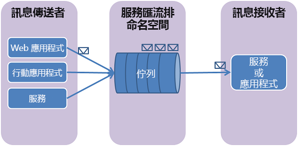


##什么是 Service Bus 队列？

Service Bus 队列支持**中转消息传送通信**模型。使用队列时，分布式应用程序的组件不直接相互通信，而是交换消息 （通过充当中介的队列。消息创建方 （发送方） 将传送到队列的消息，，然后继续处理。
以异步方式，消息使用者 （接收方） 将消息从队列中提取并处理它。制造者没有要等待的时间从使用者的答复即可继续处理并发送更多的消息。队列提供了**第一个、 先出 (FIFO)**消息传递到一个或多个竞争的使用者。也就是说，消息通常接收并由按顺序在其中添加到队列，和每条消息仅接收并处理由只有一个消息使用者接收方处理。

Service Bus 队列是一种通用的技术，可用于各种方案：

-   在多层中的 web 和辅助角色之间的通信 
    Azure 应用程序
-   托管在本地应用程序和 Azure 之间的通信的混合解决方案中的应用程序
-   在本地运行在不同组织或部门的组织中的分布式应用程序的组件之间的通信

使用队列可以使您能够扩展您的应用程序更好的并启用对您的体系结构的多个复原能力。

<h2>创建服务命名空间</h2>

若要开始在 Azure 中使用 Service Bus 队列，必须首先创建一个服务命名空间。服务命名空间提供用于在您的应用程序中的 Service Bus 资源进行寻址的范围容器。

创建服务命名空间：

1.  登录到[Azure 管理门户][]。

2.  在管理门户的左侧的导航窗格中，单击
    **Service Bus**。

3.  在管理门户的下方窗格中，单击**创建**。   
	

4.  在**添加新的命名空间**对话框中，输入命名空间名称。
    系统会立即检查该名称是否可用。   
	

5.  确保命名空间名称可用后，选择的国家或地区，应在其中托管您的命名空间 （请确保使用相同的国家/地区部署你的计算资源）。

	重要：选取**同一区域**您想要选择用于部署应用程序。这将为你提供最佳性能。

6. 	单击复选标记。系统现已创建您的服务命名空间并已将其启用。您可能需要等待几分钟，因为系统将为您的帐户配置资源。

	

您创建的命名空间随后将显示在管理门户中，然后要花费一段时间来激活。等待直到状态显示为**Active**然后再继续。

<h2>获得命名空间的默认管理凭据</h2>

为了执行管理操作如在新命名空间，创建一个队列中，您必须获取该命名空间的管理凭据。从管理门户或从 Visual Studio 服务器资源管理器，您可以获取这些凭据。

###若要从门户获取管理凭据

1.  在左侧的导航窗格中，单击**Service Bus**节点，以显示可用命名空间的列表：   
	

2.  从显示的列表中选择刚刚创建的命名空间：   
	

3.  单击**连接信息**。   
	

4.  在**访问连接信息**对话框中，查找**默认颁发者**和**默认密钥**条目。记下这些值，因为您将在下面使用此信息来对命名空间执行操作。

###若要从服务器资源管理器获取管理凭据

若要获取连接信息 （而不管理门户中使用 Visual Studio，请按照上述过程[此处](http://http://msdn.microsoft.com/zh-cn/library/windowsazure/ff687127.aspx)，一节中**从 Visual Studio 连接到 Azure**。当您登录到 Azure， **Service Bus**节点下的**Microsoft Azure**树中的在服务器资源管理器会自动填充的任何已创建的命名空间。右键单击任何命名空间，然后单击**属性**若要查看连接字符串和其他与在 Visual Studio 中显示此命名空间关联的元数据**属性**窗格。 

记下**SharedAccessKey**值，或将其复制到剪贴板：

![][34]

  [Azure 管理门户]: http://manage.windowsazure.com
  [Azure 管理门户]: http://manage.windowsazure.com

  [34]: ./media/howto-service-bus-queues/VSProperties.png
