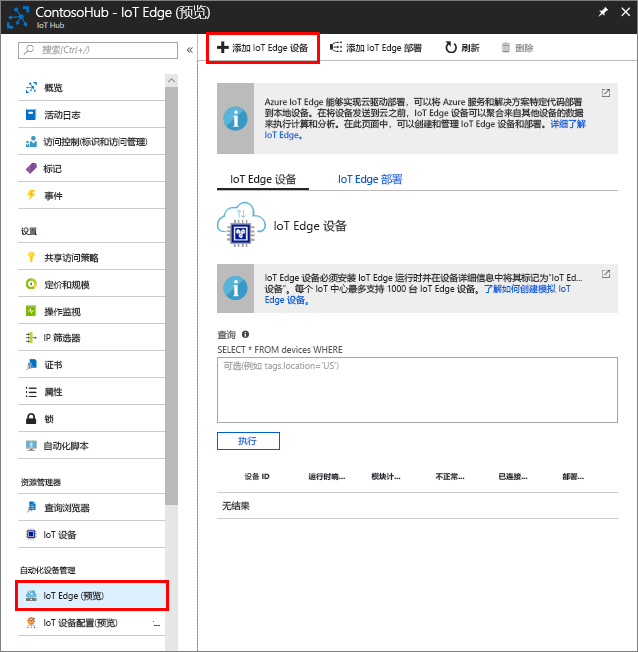

为模拟设备创建设备标识，以便它可以与 IoT 中心通信。 由于 IoT Edge 设备的行为和托管方式与典型 IoT 设备不同，请从一开始就将此设备声明为 IoT Edge 设备。 

1. 在 Azure 门户中导航到 IoT 中心。
1. 选择“IoT Edge”，然后选择“添加 IoT Edge 设备”。

   

1. 为模拟设备指定唯一设备 ID。
1. 选择“保存”以添加设备。
1. 从设备列表中选择新设备。
1. 复制“连接字符串 - 主密钥”的值并保存。 在下一部分中配置 IoT Edge 运行时时将用到此值。 

