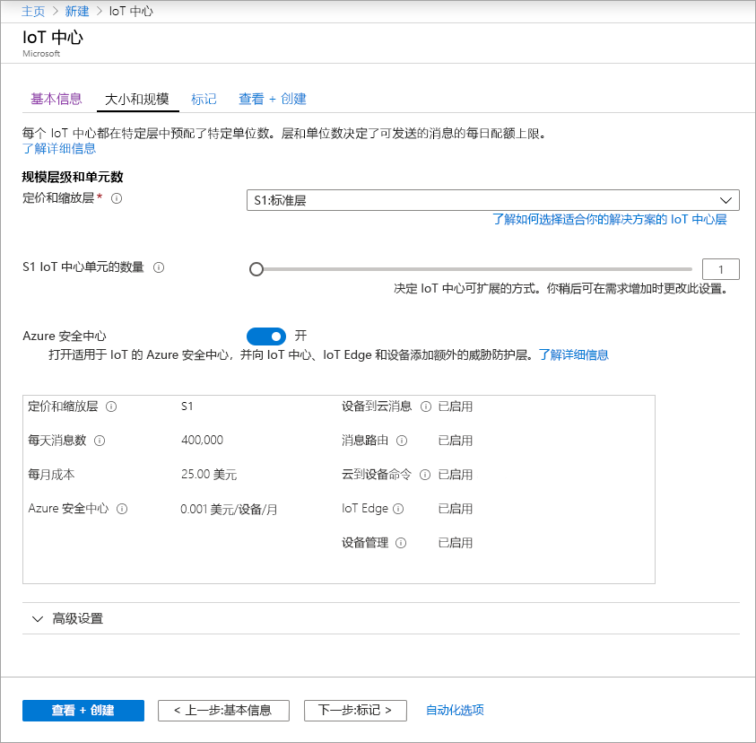

此部分介绍如何使用 [Azure 门户](https://portal.azure.com)创建 IoT 中心。

1. 登录到 [Azure 门户](https://portal.azure.com)。

1. 选择“创建资源”，然后在“搜索市场”字段中输入“IoT 中心”。   

1. 在搜索结果中选择“IoT 中心”，然后选择“创建”   。

1. 在“基本信息”选项卡上，按如下所示填写字段： 

   - **订阅**：选择要用于中心的订阅。

   - **资源组**：选择一个资源组或新建一个资源组。 若要新建资源组，请选择“新建”并填写要使用的名称。  若要使用现有的资源组，请选择它。 有关详细信息，请参阅[管理 Azure 资源管理器资源组](../articles/azure-resource-manager/manage-resource-groups-portal.md)。

   - **区域**：选择中心所在的区域。 选择最靠近你的位置。

   - **IoT 中心名称**：输入中心的名称。 该名称必须全局唯一。 如果输入的名称可用，会显示一个绿色复选标记。

   [!INCLUDE [iot-hub-pii-note-naming-hub](iot-hub-pii-note-naming-hub.md)]

   

1. 在完成时选择“下一步:  大小和规模”，以继续创建中心。

   

    在此屏幕中可以设置以下值：

    - **定价和缩放层**：选择的层。 可以根据你需要的功能数以及每天通过解决方案发送的消息数从多个层中进行选择。 免费层适用于测试和评估。 允许 500 台设备连接到中心，每天最多可传输 8,000 条消息。 每个 Azure 订阅可以在免费层中创建一个 IoT 中心。

    - **IoT 中心单元**：每日每单位允许的消息数取决于中心的定价层。 例如，如果希望中心支持 700,000 条消息引入，请选择两个 S1 层单位。
    有关其他层选项的详细信息，请参阅[选择合适的 IoT 中心层](../articles/iot-hub/iot-hub-scaling.md)。

    - **高级** > **设备到云的分区**：此属性将设备到云消息与这些消息的同步读取器数目相关联。 大多数中心只需要 4 个分区。

1. 对于本教程，请接受默认选项，然后选择“查看 + 创建”以查看所做的选择。  会显示类似于以下的屏幕。

   

1. 选择“创建”以创建新的中心  。 创建中心需要几分钟时间。
