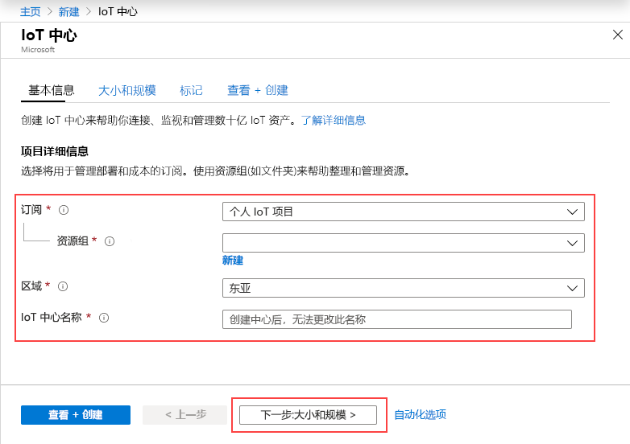
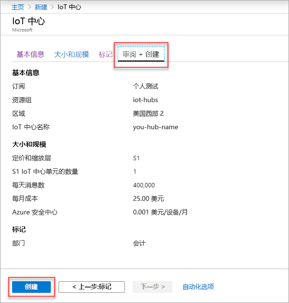

此部分介绍如何使用 [Azure 门户](https://portal.azure.com)创建 IoT 中心。

1. 登录到 [Azure 门户](https://portal.azure.com)。 

2. 选择“+创建资源”，然后*搜索市场*，寻找 **IoT 中心**  。

3. 选择“IoT 中心”，然后单击“创建”按钮   。 随即显示 IoT 中心创建过程的第一个屏幕。

   

   填充字段。

   **订阅**：请选择要用于 IoT 中心的订阅。

   **资源组**：可创建新的资源组或使用现有资源组。 若要新建一个，请单击“新建”  ，并填写要使用的名称。 若要使用现有资源组，请单击“使用现有资源组”  并从下拉列表中选择该组。 有关详细信息，请参阅[管理 Azure 资源管理器资源组](../articles/azure-resource-manager/manage-resource-groups-portal.md)。

   **区域**：这是要在其中设置中心的区域。 从下拉列表中选择最靠近自己的位置。

   **IoT 中心名称**：输入 IoT 中心的名称。 该名称必须全局唯一。 如果输入的名称可用，会显示一个绿色复选标记。

   [!INCLUDE [iot-hub-pii-note-naming-hub](iot-hub-pii-note-naming-hub.md)]

4. 单击“下一步:  大小和规模”，以便继续创建 IoT 中心。

   

   在此屏幕上，可以采用默认值，只需在底部单击“查看+创建”即可  。 

   **定价和缩放层**：可以根据你需要的功能数以及每天通过解决方案发送的消息数从多个层中进行选择。 免费层适用于测试和评估。 它允许 500 台设备连接到 IoT 中心，并且每天最多传输 8,000 条信息。 每个 Azure 订阅可以在免费层中创建一个 IoT 中心。 

   **IoT 中心单元**：每日每单位允许的消息数取决于中心的定价层。 例如，如果希望 IoT 中心支持 700,000 条消息输入，则选择两个 S1 层单位。

   有关其他层选项的详细信息，请参阅[选择合适的 IoT 中心层](../articles/iot-hub/iot-hub-scaling.md)。

   **高级 / 设备到云分区**：此属性将设备到云消息与这些消息的同步读取器数目相关联。 大多数 IoT 中心只需要 4 个分区。 

5. 单击“查看+创建”  可查看选择。 会显示类似于以下的屏幕。

   

6. 单击“创建”以创建新的 IoT 中心  。 创建中心需要几分钟时间。
