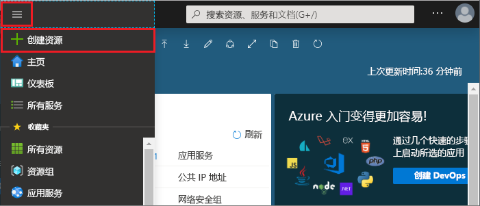
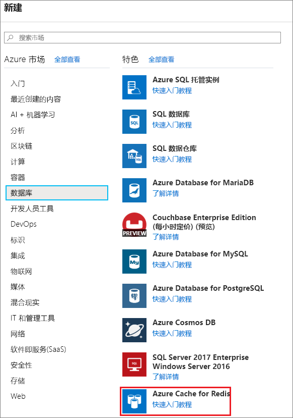
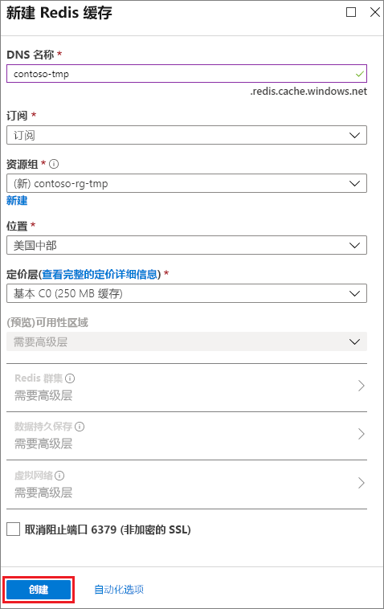

1. 若要创建缓存，请登录到 [Azure 门户](https://portal.azure.com)并选择“创建资源”  。 
   
   
   
1. 在“新建”页上选择“数据库”，然后选择“Azure Cache for Redis”。   
   
   
   
1. 在“新建 Redis 缓存”页上配置新缓存的设置。 
   
   | 设置      | 建议的值  | 说明 |
   | ------------ |  ------- | -------------------------------------------------- |
   | **DNS 名称** | 输入任何全局唯一的名称。 | 缓存名称必须是包含 1 到 63 个字符的字符串，只能包含数字、字母或连字符。 该名称必须以数字或字母开头和结尾，且不能包含连续的连字符。 缓存实例的主机名是 *\<DNS 名称>.redis.cache.windows.net*。  | 
   | **订阅** | 单击下拉箭头并选择你的订阅。 | 要在其下创建此新的 Azure Cache for Redis 实例的订阅。 | 
   | **资源组** | 单击下拉箭头并选择一个资源组，或者选择“新建”并输入新的资源组名称。  | 要在其中创建缓存和其他资源的资源组的名称。 将所有应用资源放入一个资源组可以轻松地统一管理或删除这些资源。 | 
   | **位置** | 单击下拉箭头并选择一个位置。 | 选择与要使用该缓存的其他服务靠近的[区域](https://azure.microsoft.com/regions/)。 |
   | **定价层** | 单击下拉箭头并选择一个[定价层](https://azure.microsoft.com/pricing/details/cache/)。 |  定价层决定可用于缓存的大小、性能和功能。 有关详细信息，请参阅[用于 Redis 的 Azure 缓存概述](../articles/azure-cache-for-redis/cache-overview.md)。 |
   
1. 选择“创建”  。 
   
    
   
   创建缓存需要花费片刻时间。 可以在 Azure Cache for Redis 的“概述”页上监视进度。  如果“状态”显示为“正在运行”，则表示该缓存可供使用。  
   
   

