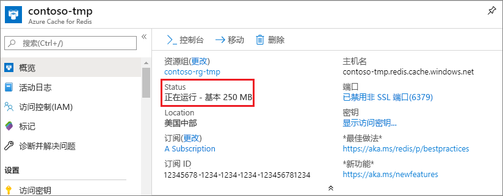

若要创建缓存，首先登录到[Azure 门户](https://portal.azure.com)，然后单击**新建** > **数据库** > **Redis 缓存**。

> [!NOTE]
> 如果你没有 Azure 帐户，则可以[免费建立一个 Azure 帐户](https://azure.microsoft.com/pricing/free-trial/?WT.mc_id=redis_cache_hero)几分钟即可完成。
> 
> 

> [!NOTE]
> 除了在 Azure 门户中创建缓存，你还可以创建使用资源管理器模板、 PowerShell 或 Azure CLI。
> 
> * 若要创建缓存使用资源管理器模板，请参阅[创建 Redis 缓存使用模板](../articles/redis-cache/cache-redis-cache-arm-provision.md)。
> * 若要创建缓存使用 Azure PowerShell，请参阅[管理 Azure Redis 缓存使用 Azure PowerShell](../articles/redis-cache/cache-howto-manage-redis-cache-powershell.md)。
> * 若要创建缓存使用 Azure CLI，请参阅[如何创建和管理 Azure Redis 缓存使用 Azure 命令行界面 (Azure CLI)](../articles/redis-cache/cache-manage-cli.md)。
> 
> 

在**新建 Redis 缓存**边栏选项卡，指定缓存所需的配置。

 

* 在**Dns 名称**，输入要用于缓存终结点的唯一缓存名称。 缓存名称必须是 1 到 63 个字符的字符串，仅包含数字、 字母和`-`字符。 缓存名称不能以开头或结尾`-`字符，并连续`-`字符不是有效。
* 有关**订阅**，选择你想要用于缓存的 Azure 订阅。 如果你的帐户具有只有一个订阅，它将自动选择和**订阅**下拉列表将不会显示。
* 在**资源组**，选择或创建你的缓存的资源组。 有关详细信息，请参阅[使用资源组管理 Azure 资源](../articles/azure-resource-manager/resource-group-overview.md)。 
* 使用**位置**以指定在其中托管你的缓存的地理位置。 为了获得最佳性能，Microsoft 强烈建议你在缓存客户端应用程序所在的同一区域中创建缓存。
* 使用**定价层**来选择所需的缓存大小和功能。
* **Redis 群集**允许你创建大于 53 GB 和分片数据的最大缓存，跨多个 Redis 节点。 有关详细信息，请参阅[如何为高级 Azure Redis 缓存配置群集功能](../articles/redis-cache/cache-how-to-premium-clustering.md)。
* **Redis 暂留**提供可以保存你的缓存到 Azure 存储帐户。 有关配置持久性的说明，请参阅[如何为高级 Azure Redis 缓存配置暂留](../articles/redis-cache/cache-how-to-premium-persistence.md)。
* **虚拟网络**通过限制于仅在指定的 Azure 虚拟网络的这些客户端缓存访问提供增强的安全性和隔离。 你可以使用的子网，访问控制策略，如 VNet 的所有功能和其他功能进一步限制对 Redis 的访问。 有关详细信息，请参阅[如何为高级 Azure Redis 缓存配置虚拟网络支持](../articles/redis-cache/cache-how-to-premium-vnet.md)。
* 默认情况下，为新缓存禁用非 SSL 访问。 若要启用非 SSL 端口，请检查**取消阻止端口 6379 (不 SSL 加密)**。

新的缓存选项配置后，单击**创建**。 可能需要几分钟的时间要创建缓存。 若要检查的状态，可以监视在启动板上的进度。 创建缓存后，新缓存具有**运行**状态并且随时可供用于[默认设置](../articles/redis-cache/cache-configure.md#default-redis-server-configuration)。

