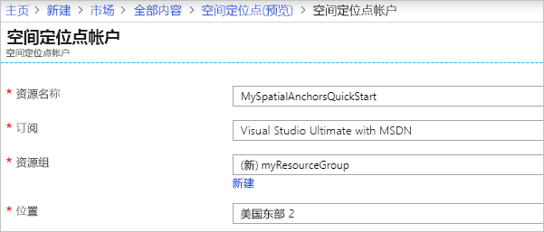
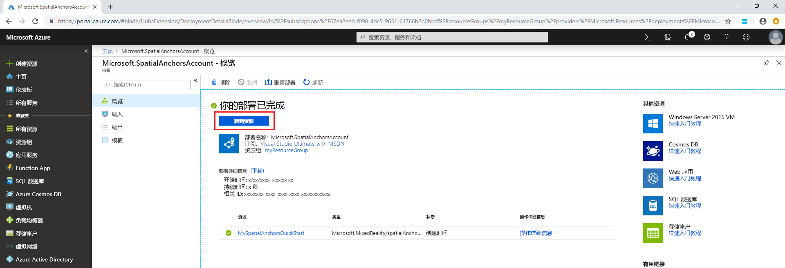
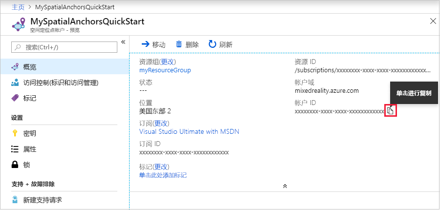
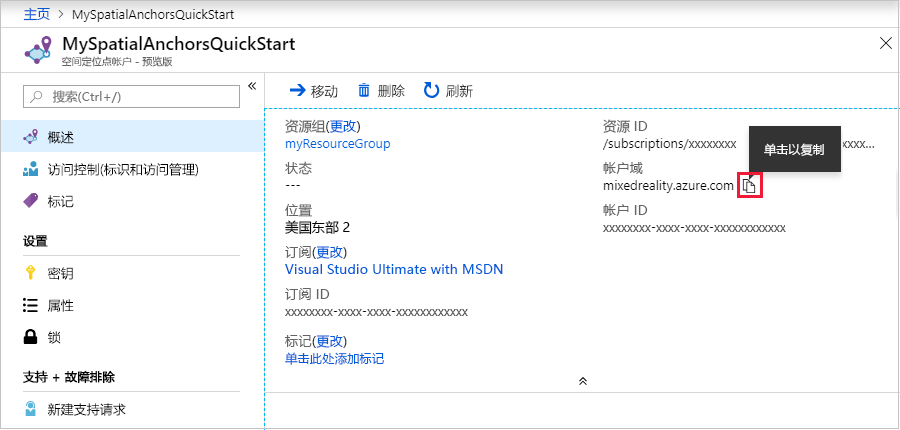

## 创建空间定位点资源

转到 <a href="https://portal.azure.com" target="_blank">Azure 门户</a>。

在 Azure 门户的左侧导航窗格中，选择“创建资源”。

使用搜索框以搜索“空间定位点”。

   

搜索“空间定位点”。 在对话框中，选择“创建”。

在“空间定位点帐户”对话框中：

- 使用常规字母数字字符输入唯一的资源名称。
- 选择想要将资源附加到的订阅。
- 选择“新建”可创建资源组。 将其命名为 myResourceGroup 并选择“确定” 。
      [!INCLUDE [resource group intro text](resource-group.md)]
- 选择可在其中放置资源的位置（区域）。
- 选择“新建”开始创建资源。

   

创建资源后，Azure 门户将显示部署已完成。 单击“转到资源”。

然后，可以查看资源属性。 将资源的“帐户 ID”值复制到文本编辑器，因为稍后需要用它。

   

另外将资源的“帐户域”值复制到文本编辑器，因为稍后需要用它。

   

在“设置”下，选择“密钥” 。 将“主键”值复制到文本编辑器中。 此值为 `Account Key`。 稍后需要用到此信息。

   
