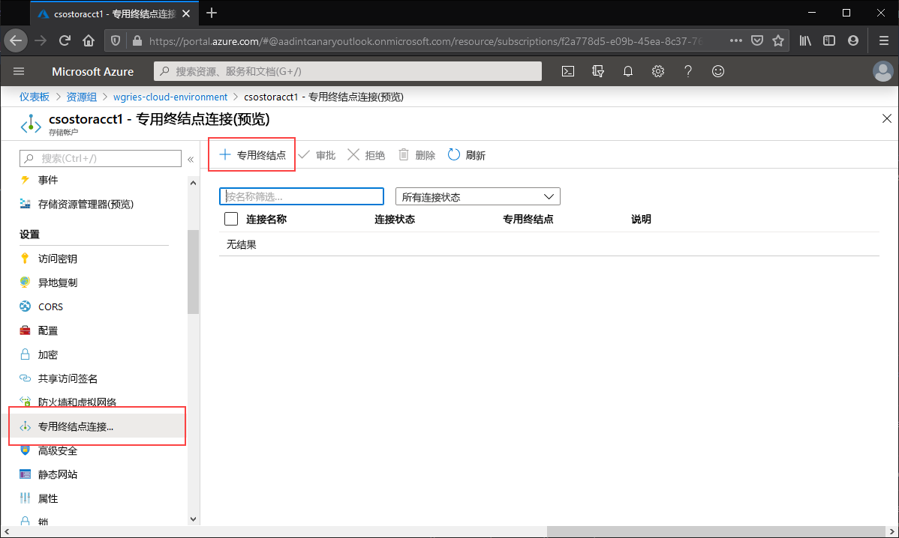
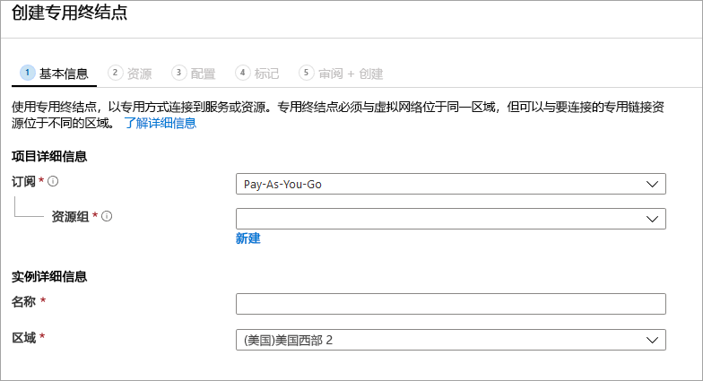
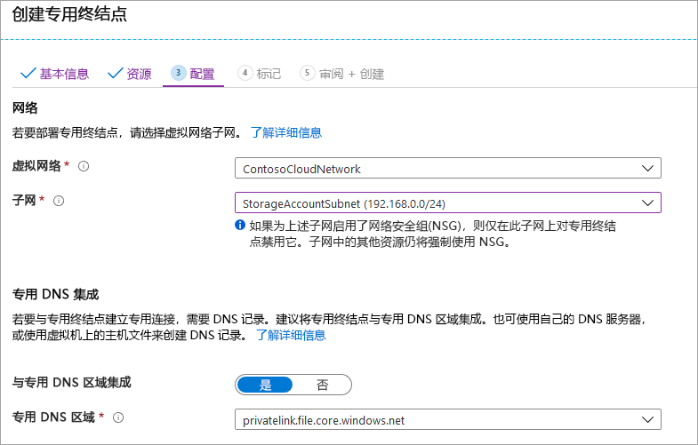

导航到要为其创建专用终结点的存储帐户。 在存储帐户的目录中选择“专用终结点连接”，然后选择“+ 专用终结点”创建新的专用终结点。  

出现的向导包含多个要完成的页。

在“基本信息”边栏选项卡中，为专用终结点选择所需的资源组、名称和区域。 资源组、名称和区域可以任意配置，不必与存储帐户匹配，但必须在同一区域中创建专用终结点和用于容纳该专用终结点的存储帐户。

在“资源”边栏选项卡中，选中“连接到目录中的 Azure 资源”对应的单选按钮。  在“资源类型”下，选择“Microsoft.Storage/storageAccounts”为资源类型 。 “资源”字段用于指定包含要连接到的 Azure 文件共享的存储帐户。 因为针对 Azure 文件存储，所以目标子资源是“文件”。

在“配置”边栏选项卡中，可以选择要向其添加专用终结点的特定虚拟网络和子网。 必须选择上面将服务终结点添加到的子网以外的子网。 “配置”边栏选项卡还包含用于创建/更新专用 DNS 区域的信息。 建议使用默认的 `privatelink.file.core.windows.net` 区域。

单击“查看 + 创建”以创建专用终结点。 