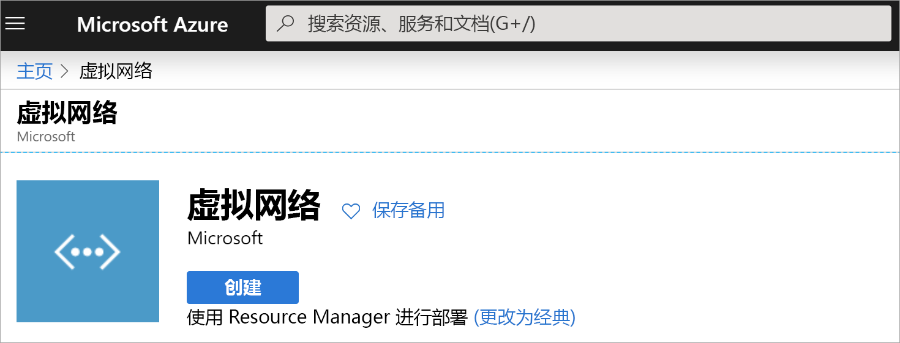

可以通过以下步骤使用资源管理器部署模型和 Azure 门户创建一个 VNet。 有关虚拟网络的详细信息，请参阅[虚拟网络概述](../articles/virtual-network/virtual-networks-overview.md)。

>[!NOTE]
>为了让此 VNet 连接到本地位置，请与本地网络管理员协调操作，指定一个 IP 地址范围，将其专用于此虚拟网络。 如果 VPN 连接的两端存在重复的地址范围，则会以意外方式路由流量。 另外，若要将此 VNet 连接到其他 VNet，则地址空间不能与其他 VNet 重叠。 相应地规划网络配置。
>
>

1. 登录 [Azure 门户](https://portal.azure.com)。
1. 在**搜索资源、服务和文档（G +/）** 中，键入 "*虚拟网络*"。

   
1. 从**Marketplace**结果中选择 "**虚拟网络**"。

   
1. 在 "**虚拟网络**" 页上，单击 "**创建**"。

   
1. 单击 "创建" 后，将打开 "**创建虚拟网络**" 页。

   
1. 在“创建虚拟网络”页上，配置 VNet 设置。 填写字段时，当你在字段中输入的字符通过验证时，红色感叹号标记会变成绿色对钩标记。 某些值是自动填写的，你可以将其替换为自己的值：

   - “名称”：输入虚拟网络的名称。
   - **地址空间**：输入地址空间。 如果有多个要添加的地址空间，请在此处输入你的第一个地址空间。 可以在创建 VNet 后再添加其他地址空间。 如果你的配置需要 IPv6 地址空间，请选中该复选框以输入该信息。
   - “订阅”：确认列出的是正确的订阅。 可以使用下拉列表更改订阅。
   - **资源组**：选择现有资源组，或通过输入新资源组的名称创建一个新的资源组。 如果要创建新组，请根据计划的配置值来命名资源组。 有关资源组的详细信息，请参阅 [Azure 资源管理器概述](../articles/azure-resource-manager/management/overview.md#resource-groups)。
   - **位置**：选择 VNet 的位置。 该位置确定要部署到此 VNet 的资源将位于哪里。
   - **子网**：添加子网**名称**和子网**地址范围**。 可在创建 VNet 后再添加其他子网。
   - **DDos 保护**：选择 "**基本**"，除非你想要使用标准服务。
   - **服务终结点**：可以将此设置保留为**禁用状态**，除非配置指定此设置。
   - **防火墙**：你可以将此设置保留为 "**已禁用**"，除非你的配置指定了此设置。
1. 单击 "**创建**" 以开始虚拟网络部署。
