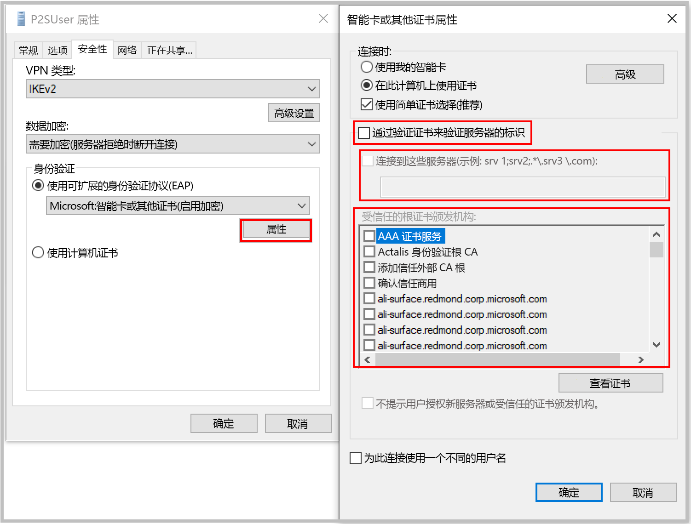

### 在我的点到站点配置中，可以有多少 VPN 客户端终结点？

这取决于网关 SKU。 有关支持的连接数的详细信息，请参阅[网关 SKU](../articles/vpn-gateway/vpn-gateway-about-vpngateways.md#gwsku)。

### 点到站点连接可以用于哪些客户端操作系统？

支持以下客户端操作系统：

* Windows 7（32 位和 64 位）
* Windows Server 2008 R2（仅 64 位）
* Windows 8.1（32 位和 64 位）
* Windows Server 2012（仅 64 位）
* Windows Server 2012 R2（仅 64 位）
* Windows Server 2016（仅 64 位）
* Windows 10
* Mac OS X 版本 10.11 或更高版本
* Linux (StrongSwan)
* iOS

[!INCLUDE [TLS](vpn-gateway-tls-updates.md)]

### 如果在连接时收到证书不匹配，我该怎么办？

取消选中 **"通过验证证书来验证服务器的标识"** ，或者在手动创建配置文件时**添加服务器 FQDN 以及证书**。 为此，可以从命令提示符运行**rasphone** ，并从下拉列表中选择配置文件。

### 能否使用点到站点功能穿越代理和防火墙？

Azure 支持三种类型的点到站点 VPN 选项：

* 安全套接字隧道协议 (SSTP)。 SSTP 是 Microsoft 专用的基于 SSL 的解决方案，它可以穿透防火墙，因为大多数防火墙都打开 443 SSL 使用的出站 TCP 端口。

* OpenVPN. OpenVPN 是一个基于 SSL 的解决方案，它可以穿透防火墙，因为大多数防火墙都打开 443 SSL 使用的出站 TCP 端口。

* IKEv2 VPN。 IKEv2 VPN 是一种基于标准的 IPsec VPN 解决方案，它使用出站 UDP 端口500和4500以及 IP 协议 no。 50。 防火墙并非始终打开这些端口，因此，IKEv2 VPN 有可能无法穿过代理和防火墙。

### 如果重新启动进行过点到站点配置的客户端计算机，是否会自动重新连接 VPN？

默认情况下，客户端计算机将不自动重新建立 VPN 连接。

### 点到站点在 VPN 客户端上是否支持自动重新连接和 DDNS？

点到站点 VPN 中当前不支持自动重新连接和 DDNS。

### 对于同一虚拟网络，站点到站点和点到站点配置能否共存？

可以。 对于资源管理器部署模型，必须为网关使用 RouteBased VPN 类型。 对于经典部署模型，需要一个动态网关。 不支持将点到站点配置用于静态路由 VPN 网关或 PolicyBased VPN 网关。

### 能否将点到站点客户端配置为同时连接到多个虚拟网络？

不。 点到站点客户端只能连接到虚拟网络网关所在的 VNet 中的资源。

### 预计通过站点到站点连接或点到站点连接的吞吐量有多少？

很难维持 VPN 隧道的准确吞吐量。 IPsec 和 SSTP 是重重加密的 VPN 协议。 本地网络与 Internet 之间的延迟和带宽也限制了吞吐量。 对于仅具有 IKEv2 点到站点 VPN 连接的 VPN 网关，期望可以实现的总吞吐量取决于网关 SKU。 有关吞吐量的详细信息，请参阅[网关 SKU](../articles/vpn-gateway/vpn-gateway-about-vpngateways.md#gwsku)。

### 是否可以将任何软件 VPN 客户端用于支持 SSTP 和/或 IKEv2 的点到站点配置？

不。 只能将 Windows 上的本机 VPN 客户端用于 SSTP，只能将 Mac 上的本机 VPN 客户端用于 IKEv2。 但是，可以在所有平台上使用 OpenVPN 客户端通过 OpenVPN 协议进行连接。 请参阅支持的客户端操作系统的列表。

### Azure 是否支持使用 Windows 的 IKEv2 VPN？

在 Windows 10 和 Server 2016 上支持 IKEv2。 但是，若要使用 IKEv2，必须在本地安装更新并设置注册表项值。 Windows 10 之前的操作系统版本不受支持，只能使用 SSTP 或**OpenVPN®协议**。

为运行 IKEv2 准备 Windows 10 或 Server 2016：

1. 安装更新。

   | OS 版本 | Date | 编号/链接 |
   |---|---|---|
   | Windows Server 2016 Windows 10 版本 1607 | 2018 年 1 月 17 日 | [KB4057142](https://support.microsoft.com/help/4057142/windows-10-update-kb4057142) |
   | Windows 10 版本 1703 | 2018 年 1 月 17 日 | [KB4057144](https://support.microsoft.com/help/4057144/windows-10-update-kb4057144) |
   | Windows 10 版本 1709 | 2018 年 3 月 22 日 | [KB4089848](https://www.catalog.update.microsoft.com/search.aspx?q=kb4089848) |
   |  |  |  |

2. 设置注册表项值。 在注册表中创建“HKEY_LOCAL_MACHINE\SYSTEM\CurrentControlSet\Services\RasMan\ IKEv2\DisableCertReqPayload”REG_DWORD 键或将其设置为 1。

### 为 P2S VPN 连接配置 SSTP 和 IKEv2 时，会发生什么情况？

在混合环境（包括 Windows 和 Mac 设备）中同时配置了 SSTP 和 IKEv2 时，Windows VPN 客户端始终将先尝试使用 IKEv2 隧道，但如果 IKEv2 连接不成功将回退到 SSTP。 MacOSX 将仅通过 IKEv2 进行连接。

### 除了 Windows 和 Mac 以外，Azure 还支持在其他哪些平台上使用 P2S VPN？

Azure 支持将 Windows、Mac 和 Linux 用于 P2S VPN。

### 我已部署 Azure VPN 网关。 是否可在该网关上启用 RADIUS 和/或 IKEv2 VPN？

是的，可以使用 Powershell 或 Azure 门户在已部署的网关上启用这些新功能，前提是所用网关 SKU 支持 RADIUS 和/或 IKEv2。 例如，VPN 网关基本 SKU 不支持 RADIUS 或 IKEv2。
